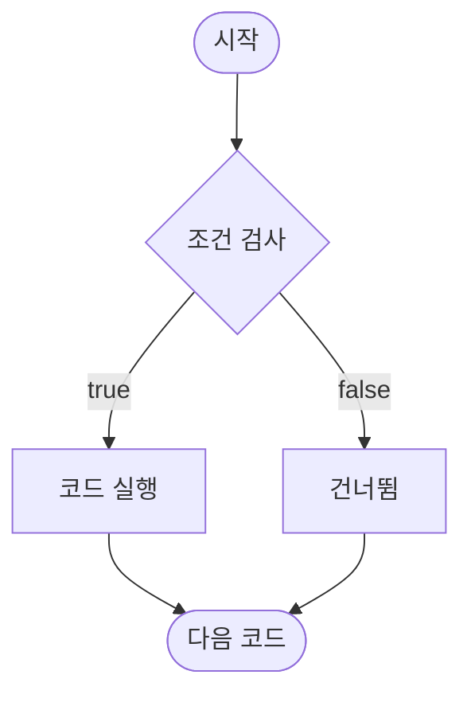
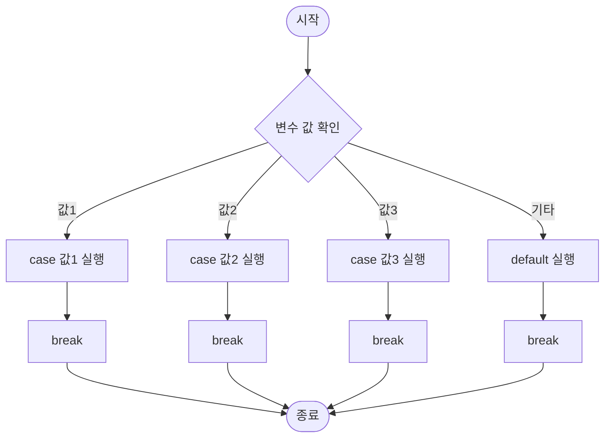
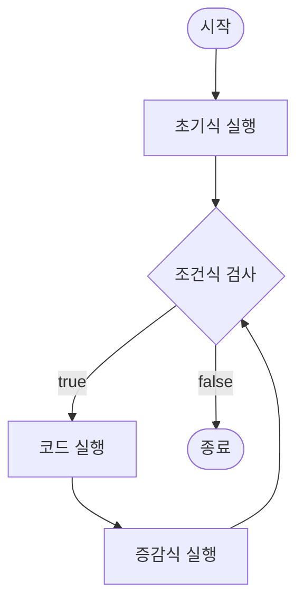
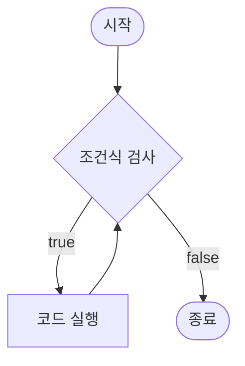
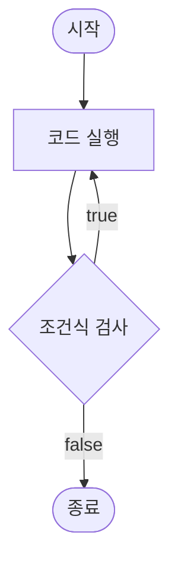

# Day 02: C 언어 기본 구조 (2)

## 📚 학습 목표
- 다양한 연산자 사용하기
- 조건문으로 프로그램 흐름 제어하기
- 반복문으로 반복 작업 자동화하기
- 간단한 게임과 프로그램 만들기

## ⏰ 시간 배분 (3시간)
| 시간 | 내용 | 이론 | 실습 |
|------|------|------|------|
| 50분 | **1교시**: 연산자 활용 | 15분 | 35분 |
| 10분 | 휴식 | - | - |
| 50분 | **2교시**: 조건문 (if, switch) | 20분 | 30분 |
| 10분 | 휴식 | - | - |
| 50분 | **3교시**: 반복문과 종합 실습 | 15분 | 35분 |
| 10분 | Q&A 및 정리 | - | - |

> **강사 노트**: 실습 중심 수업으로 진행합니다. 학습자가 직접 코드를 작성하면서 연산자, 조건문, 반복문의 동작을 체감할 수 있도록 합니다.

---

## 🎯 1교시: 연산자 활용 (50분)

### 📖 이론 (15분)

#### 1.1 산술 연산자

**기본 연산자**

| 연산자 | 의미 | 예시 | 결과 |
|--------|------|------|------|
| `+` | 덧셈 | `10 + 3` | `13` |
| `-` | 뺄셈 | `10 - 3` | `7` |
| `*` | 곱셈 | `10 * 3` | `30` |
| `/` | 나눗셈 | `10 / 3` | `3` (정수) |
| `%` | 나머지 | `10 % 3` | `1` |

**중요한 개념:**
```c
// 정수 나눗셈 vs 실수 나눗셈
int a = 10, b = 3;
printf("%d\n", a / b);          // 3 (정수 나눗셈, 소수점 버림)

double x = 10.0, y = 3.0;
printf("%f\n", x / y);          // 3.33333 (실수 나눗셈)

// 형변환으로 실수 나눗셈
printf("%f\n", (double)a / b);  // 3.33333
```

**증감 연산자**

```c
int x = 10;

// 전위 증가: 먼저 증가, 그 다음 사용
printf("%d\n", ++x);  // x를 11로 증가 → 11 출력

// 후위 증가: 먼저 사용, 그 다음 증가
printf("%d\n", x++);  // 11 출력 → x를 12로 증가
```

| 연산자 | 의미 | 순서 |
|--------|------|------|
| `++x` | 전위 증가 | 증가 → 사용 |
| `x++` | 후위 증가 | 사용 → 증가 |
| `--x` | 전위 감소 | 감소 → 사용 |
| `x--` | 후위 감소 | 사용 → 감소 |

#### 1.2 비교 연산자

| 연산자 | 의미 | 예시 | 결과 |
|--------|------|------|------|
| `==` | 같음 | `5 == 5` | `1` (참) |
| `!=` | 다름 | `5 != 3` | `1` (참) |
| `>` | 큼 | `5 > 3` | `1` (참) |
| `<` | 작음 | `5 < 3` | `0` (거짓) |
| `>=` | 크거나 같음 | `5 >= 5` | `1` (참) |
| `<=` | 작거나 같음 | `5 <= 3` | `0` (거짓) |

**C 언어의 참/거짓:**
- **참(true)**: 0이 아닌 모든 값 (보통 1)
- **거짓(false)**: 0

```c
int result = (5 > 3);  // result = 1 (참)
printf("%d\n", result);

if (5 > 3) {
    printf("참입니다\n");  // 실행됨
}
```

#### 1.3 논리 연산자

| 연산자 | 의미 | 예시 | 결과 |
|--------|------|------|------|
| `&&` | AND (그리고) | `1 && 0` | `0` (거짓) |
| `\|\|` | OR (또는) | `1 \|\| 0` | `1` (참) |
| `!` | NOT (부정) | `!1` | `0` (거짓) |

**진리표:**
```
A     B     A && B    A || B    !A
1     1        1         1       0
1     0        0         1       0
0     1        0         1       1
0     0        0         0       1
```

**실제 사용 예:**
```c
int age = 20;
int has_license = 1;  // 1 = true, 0 = false

// AND: 둘 다 참이어야 참
if (age >= 18 && has_license) {
    printf("운전 가능\n");
}

// OR: 하나라도 참이면 참
if (age < 18 || !has_license) {
    printf("운전 불가\n");
}
```

---

### 💻 실습 (35분)

#### 💻 실습 2-1: 계산기 프로그램 (15분)

**목표**: 두 수를 입력받아 모든 산술 연산 결과 출력하기

```c
#include <stdio.h>

int main() {
    int num1, num2;
    
    printf("===== 계산기 프로그램 =====\n");
    printf("첫 번째 숫자를 입력하세요: ");
    scanf("%d", &num1);
    
    printf("두 번째 숫자를 입력하세요: ");
    scanf("%d", &num2);
    
    printf("\n===== 계산 결과 =====\n");
    printf("%d + %d = %d\n", num1, num2, num1 + num2);
    printf("%d - %d = %d\n", num1, num2, num1 - num2);
    printf("%d × %d = %d\n", num1, num2, num1 * num2);
    
    // 나눗셈 (0으로 나누기 체크)
    if (num2 != 0) {
        printf("%d ÷ %d = %d (정수 나눗셈)\n", num1, num2, num1 / num2);
        printf("%d ÷ %d = %.2f (실수 나눗셈)\n", num1, num2, (double)num1 / num2);
        printf("%d %% %d = %d (나머지)\n", num1, num2, num1 % num2);
    } else {
        printf("0으로 나눌 수 없습니다!\n");
    }
    
    return 0;
}
```

**실행 예시:**
```
===== 계산기 프로그램 =====
첫 번째 숫자를 입력하세요: 17
두 번째 숫자를 입력하세요: 5

===== 계산 결과 =====
17 + 5 = 22
17 - 5 = 12
17 × 5 = 85
17 ÷ 5 = 3 (정수 나눗셈)
17 ÷ 5 = 3.40 (실수 나눗셈)
17 % 5 = 2 (나머지)
```

**핵심 개념:**
- 정수 나눗셈 (`/`): 소수점 버림
- 실수 나눗셈: `(double)` 형변환 필요
- 나머지 연산자 (`%`): 정수끼리만 가능

---

#### 💻 실습 2-2: 짝수/홀수 판별기 (10분)

**목표**: 숫자를 입력받아 짝수인지 홀수인지 판별하기

```c
#include <stdio.h>

int main() {
    int number;
    
    printf("정수를 입력하세요: ");
    scanf("%d", &number);
    
    if (number % 2 == 0) {
        printf("%d는 짝수입니다.\n", number);
    } else {
        printf("%d는 홀수입니다.\n", number);
    }
    
    return 0;
}
```

**실행 예시:**
```
정수를 입력하세요: 7
7는 홀수입니다.
```

**원리:**
- 2로 나눈 나머지가 0이면 → 짝수
- 2로 나눈 나머지가 1이면 → 홀수

---

#### 💻 실습 2-3: 증감 연산자 실험 (10분)

**목표**: 전위/후위 증감 연산자의 차이 이해하기

```c
#include <stdio.h>

int main() {
    int a = 10;
    int b = 10;
    
    printf("===== 전위 증가 (++a) =====\n");
    printf("초기값 a = %d\n", a);
    printf("++a = %d\n", ++a);  // 먼저 증가 → 11
    printf("현재 a = %d\n", a);  // 11
    
    printf("\n===== 후위 증가 (b++) =====\n");
    printf("초기값 b = %d\n", b);
    printf("b++ = %d\n", b++);  // 먼저 사용 → 10 출력
    printf("현재 b = %d\n", b);  // 11
    
    printf("\n===== 복잡한 예제 =====\n");
    int x = 5;
    int result1 = ++x * 2;  // x를 6으로 증가 → 6 * 2 = 12
    printf("++x * 2 = %d (x = %d)\n", result1, x);
    
    int y = 5;
    int result2 = y++ * 2;  // 5 * 2 = 10 → y를 6으로 증가
    printf("y++ * 2 = %d (y = %d)\n", result2, y);
    
    return 0;
}
```

**실행 결과:**
```
===== 전위 증가 (++a) =====
초기값 a = 10
++a = 11
현재 a = 11

===== 후위 증가 (b++) =====
초기값 b = 10
b++ = 10
현재 b = 11

===== 복잡한 예제 =====
++x * 2 = 12 (x = 6)
y++ * 2 = 10 (y = 6)
```

---

## 🎯 2교시: 조건문 (50분)

### 📖 이론 (20분)

#### 2.1 if 문

**기본 형식:**
```c
if (조건식) {
    // 조건이 참(true)일 때 실행
}
```

**if-else 형식:**
```c
if (조건식) {
    // 조건이 참일 때
} else {
    // 조건이 거짓일 때
}
```

**if-else if-else 형식:**
```c
if (조건1) {
    // 조건1이 참
} else if (조건2) {
    // 조건2가 참
} else if (조건3) {
    // 조건3이 참
} else {
    // 모든 조건이 거짓
}
```

**if문 흐름도:**



#### 2.2 switch 문

**기본 형식:**
```c
switch (변수) {
    case 값1:
        // 실행 코드
        break;
    case 값2:
        // 실행 코드
        break;
    default:
        // 모든 case에 해당 안 될 때
        break;
}
```

**switch문 흐름도:**



**if vs switch 비교:**

| 구분 | if 문 | switch 문 |
|------|-------|-----------|
| 조건 | 복잡한 조건 가능 | 단순 값 비교만 |
| 타입 | 모든 타입 | int, char만 |
| 가독성 | 조건 많으면 복잡 | 많은 경우에 깔끔 |

#### 2.3 중첩 if문

```c
if (조건1) {
    if (조건2) {
        // 조건1 && 조건2가 모두 참
    }
}

// 또는 논리 연산자 사용
if (조건1 && 조건2) {
    // 같은 의미
}
```

---

### 💻 실습 (30분)

#### 💻 실습 2-4: 성적 등급 판정 (15분)

**목표**: 점수를 입력받아 A, B, C, D, F 등급 출력하기

```c
#include <stdio.h>

int main() {
    int score;
    char grade;
    
    printf("점수를 입력하세요 (0-100): ");
    scanf("%d", &score);
    
    // 입력 검증
    if (score < 0 || score > 100) {
        printf("유효하지 않은 점수입니다!\n");
        return 1;
    }
    
    // 등급 판정
    if (score >= 90) {
        grade = 'A';
    } else if (score >= 80) {
        grade = 'B';
    } else if (score >= 70) {
        grade = 'C';
    } else if (score >= 60) {
        grade = 'D';
    } else {
        grade = 'F';
    }
    
    printf("당신의 등급은 %c입니다.\n", grade);
    
    // 추가 평가
    if (grade == 'A') {
        printf("우수합니다!\n");
    } else if (grade == 'F') {
        printf("더 노력하세요!\n");
    }
    
    return 0;
}
```

**실행 예시:**
```
점수를 입력하세요 (0-100): 85
당신의 등급은 B입니다.
```

---

#### 💻 실습 2-5: 간단한 메뉴 시스템 (15분)

**목표**: switch문을 활용한 메뉴 선택 프로그램

```c
#include <stdio.h>

int main() {
    int choice;
    
    printf("===== 음료 자판기 =====\n");
    printf("1. 커피 (1000원)\n");
    printf("2. 녹차 (800원)\n");
    printf("3. 콜라 (1200원)\n");
    printf("4. 물 (500원)\n");
    printf("선택하세요: ");
    scanf("%d", &choice);
    
    switch (choice) {
        case 1:
            printf("커피를 선택하셨습니다. 1000원입니다.\n");
            break;
        case 2:
            printf("녹차를 선택하셨습니다. 800원입니다.\n");
            break;
        case 3:
            printf("콜라를 선택하셨습니다. 1200원입니다.\n");
            break;
        case 4:
            printf("물을 선택하셨습니다. 500원입니다.\n");
            break;
        default:
            printf("잘못된 선택입니다!\n");
            break;
    }
    
    return 0;
}
```

**실행 예시:**
```
===== 음료 자판기 =====
1. 커피 (1000원)
2. 녹차 (800원)
3. 콜라 (1200원)
4. 물 (500원)
선택하세요: 2
녹차를 선택하셨습니다. 800원입니다.
```

**도전 과제**: 돈을 입력받아 거스름돈을 계산하는 기능 추가하기

---

## 🎯 3교시: 반복문과 종합 실습 (50분)

### 📖 이론 (15분)

#### 3.1 for 루프

**기본 형식:**
```c
for (초기식; 조건식; 증감식) {
    // 반복 실행할 코드
}
```

**for문 흐름도:**



**실행 순서:**
1. 초기식 실행 (한 번만)
2. 조건식 검사
3. true면 코드 실행
4. 증감식 실행
5. 2번으로 돌아감
6. false면 종료

**예시:**
```c
// 1부터 5까지 출력
int i;
for (i = 1; i <= 5; i++) {
    printf("%d ", i);
}
// 출력: 1 2 3 4 5
```

**C89/C90 주의사항:**
```c
// C89: 루프 전에 변수 선언 필요
int i;
for (i = 0; i < 10; i++) { }

// C99: 루프 내 변수 선언 가능
for (int i = 0; i < 10; i++) { }
```

#### 3.2 while 루프

**기본 형식:**
```c
while (조건식) {
    // 조건이 참(true)일 동안 반복
}
```

**while문 흐름도:**



**언제 사용하나요?**
- 반복 횟수를 모를 때
- 조건에 따라 계속 반복해야 할 때

```c
int count = 0;
while (count < 5) {
    printf("%d\n", count);
    count++;
}
```

#### 3.3 do-while 루프

**기본 형식:**
```c
do {
    // 일단 한 번 실행
} while (조건식);
```

**do-while문 흐름도:**



**while vs do-while:**
- `while`: 조건 검사 → 실행
- `do-while`: 실행 → 조건 검사 (최소 1번은 실행)

#### 3.4 반복문 제어

| 키워드 | 기능 | 사용 예 |
|--------|------|---------|
| `break` | 반복문 즉시 종료 | 특정 조건에서 탈출 |
| `continue` | 현재 반복 건너뛰고 다음 반복으로 | 특정 값 제외 |

```c
// break 예시
int i;
for (i = 1; i <= 10; i++) {
    if (i == 5) break;  // 5에서 종료
    printf("%d ", i);
}
// 출력: 1 2 3 4

// continue 예시
int j;
for (j = 1; j <= 5; j++) {
    if (j == 3) continue;  // 3 건너뛰기
    printf("%d ", j);
}
// 출력: 1 2 4 5
```

---

### 💻 실습 (35분)

#### 💻 실습 2-6: 구구단 출력 (10분)

**목표**: for문으로 구구단 출력하기

```c
#include <stdio.h>

int main() {
    int dan;
    int i;
    
    printf("몇 단을 출력할까요? ");
    scanf("%d", &dan);
    
    printf("\n===== %d단 =====\n", dan);
    for (i = 1; i <= 9; i++) {
        printf("%d × %d = %d\n", dan, i, dan * i);
    }
    
    return 0;
}
```

**실행 예시:**
```
몇 단을 출력할까요? 7

===== 7단 =====
7 × 1 = 7
7 × 2 = 14
7 × 3 = 21
...
7 × 9 = 63
```

---

#### 💻 실습 2-7: 숫자 합계 계산 (10분)

**목표**: 1부터 N까지의 합 계산하기

```c
#include <stdio.h>

int main() {
    int n;
    int sum = 0;
    int i;
    
    printf("몇까지 더할까요? ");
    scanf("%d", &n);
    
    for (i = 1; i <= n; i++) {
        sum += i;  // sum = sum + i
    }
    
    printf("1부터 %d까지의 합: %d\n", n, sum);
    
    // 공식으로 검증
    int formula = n * (n + 1) / 2;
    printf("공식 결과: %d\n", formula);
    
    return 0;
}
```

**수학 공식:**
- 1 + 2 + 3 + ... + N = N × (N + 1) ÷ 2

**실행 예시:**
```
몇까지 더할까요? 100
1부터 100까지의 합: 5050
공식 결과: 5050
```

---

#### 💻 종합 실습: 숫자 맞추기 게임 (15분)

**목표**: while문과 조건문을 활용한 간단한 게임 만들기

```c
#include <stdio.h>
#include <stdlib.h>  // rand() 함수용
#include <time.h>    // time() 함수용

int main() {
    int answer, guess;
    int attempts = 0;
    
    // 랜덤 시드 초기화
    srand(time(0));
    
    // 1~100 사이 랜덤 숫자
    answer = rand() % 100 + 1;
    
    printf("===== 숫자 맞추기 게임 =====\n");
    printf("1부터 100 사이의 숫자를 맞춰보세요!\n");
    
    do {
        printf("\n추측: ");
        scanf("%d", &guess);
        attempts++;
        
        if (guess > answer) {
            printf("DOWN! 더 작은 숫자입니다.\n");
        } else if (guess < answer) {
            printf("UP! 더 큰 숫자입니다.\n");
        } else {
            printf("\n정답입니다!\n");
            printf("%d번 만에 맞추셨습니다!\n", attempts);
        }
        
    } while (guess != answer);
    
    // 평가
    if (attempts <= 5) {
        printf("대단합니다!\n");
    } else if (attempts <= 10) {
        printf("잘하셨어요!\n");
    } else {
        printf("다음엔 더 잘할 수 있어요!\n");
    }
    
    return 0;
}
```

**실행 예시:**
```
===== 숫자 맞추기 게임 =====
1부터 100 사이의 숫자를 맞춰보세요!

추측: 50
UP! 더 큰 숫자입니다.

추측: 75
DOWN! 더 작은 숫자입니다.

추측: 63
UP! 더 큰 숫자입니다.

추측: 69
정답입니다!
4번 만에 맞추셨습니다!
대단합니다!
```

**핵심 개념:**
- `rand()`: 난수 생성
- `srand(time(0))`: 랜덤 시드 초기화
- `rand() % 100 + 1`: 1~100 범위 난수

---

## 📝 핵심 개념 정리

### 오늘 배운 내용

| 주제 | 핵심 키워드 | 예시 코드 |
|------|-------------|-----------|
| **산술 연산자** | `+`, `-`, `*`, `/`, `%` | `10 / 3 = 3` |
| **비교 연산자** | `==`, `!=`, `>`, `<`, `>=`, `<=` | `age >= 18` |
| **논리 연산자** | `&&`, `\|\|`, `!` | `a > 0 && b > 0` |
| **증감 연산자** | `++`, `--` (전위/후위) | `++i` vs `i++` |
| **if 문** | 조건 분기 | `if (조건) { }` |
| **switch 문** | 다중 분기 | `switch (값) { case: }` |
| **for 루프** | 횟수 반복 | `for (i=0; i<10; i++)` |
| **while 루프** | 조건 반복 | `while (조건) { }` |
| **break/continue** | 반복 제어 | `break;`, `continue;` |

### 필수 암기 패턴

```c
// 1. if-else 패턴
if (조건) {
    // 참일 때
} else {
    // 거짓일 때
}

// 2. for 루프 패턴
int i;
for (i = 0; i < n; i++) {
    // n번 반복
}

// 3. while 루프 패턴
while (조건) {
    // 조건이 참일 동안
}

// 4. switch 패턴
switch (변수) {
    case 값1:
        // 실행
        break;
    default:
        // 기본
        break;
}
```

---

## 🎯 과제

### 과제 1: 윤년 판별 프로그램 (필수)

**요구사항:**
- 연도를 입력받기
- 윤년인지 판별하기
- 윤년 조건:
  - 4로 나누어떨어지면 윤년
  - 단, 100으로 나누어떨어지면 평년
  - 단, 400으로 나누어떨어지면 윤년

**예시 출력:**
```
연도를 입력하세요: 2024
2024년은 윤년입니다.
```

---

### 과제 2: 별 찍기 프로그램 (권장)

**요구사항:**
- 숫자 N을 입력받기
- N줄의 별 패턴 출력하기
- 각 줄마다 별의 개수가 증가

**예시 출력:**
```
줄 수를 입력하세요: 5
*
**
***
****
*****
```

**도전**: 역삼각형, 다이아몬드 패턴도 만들어보세요!

---

### 과제 3: 가위바위보 게임 (도전)

**요구사항:**
- 사용자가 가위(1), 바위(2), 보(3) 선택
- 컴퓨터가 랜덤으로 선택
- 승패 판정 및 출력
- 3판 2선승제로 확장

**힌트:**
```c
int computer = rand() % 3 + 1;  // 1~3 난수
```

---

## ❓ FAQ

### Q1: `i++`와 `++i`의 차이는?

**A:** 사용 시점의 차이입니다.
```c
int a = 5;
int b = a++;  // b = 5, a = 6 (먼저 사용, 후 증가)

int c = 5;
int d = ++c;  // d = 6, c = 6 (먼저 증가, 후 사용)
```

단순 루프에서는 차이가 없습니다:
```c
for (i = 0; i < 10; i++)  // 동일
for (i = 0; i < 10; ++i)  // 동일
```

---

### Q2: switch문에서 break를 빠뜨리면?

**A:** **Fall-through** 현상이 발생합니다.
```c
int choice = 1;
switch (choice) {
    case 1:
        printf("1\n");
        // break 없음!
    case 2:
        printf("2\n");
        break;
}
// 출력: 1
//       2
```

**항상 break를 사용하세요!** (의도적인 경우 제외)

---

### Q3: 무한 루프 만드는 방법은?

**A:** 조건을 항상 참으로 만들면 됩니다.
```c
// 방법 1
while (1) {
    // 무한 반복
}

// 방법 2
for (;;) {
    // 무한 반복
}

// 탈출은 break로
while (1) {
    if (조건) break;
}
```

---

### Q4: for vs while, 언제 사용하나요?

**A:** 상황에 따라 선택합니다.

| 상황 | 추천 | 이유 |
|------|------|------|
| 반복 횟수를 알 때 | `for` | 코드가 간결 |
| 반복 횟수를 모를 때 | `while` | 조건만 검사 |
| 최소 1번은 실행 | `do-while` | 조건 나중 검사 |

```c
// 명확한 횟수
for (i = 0; i < 10; i++) { }

// 조건에 따라
while (input != 0) { }

// 최소 1번 실행
do {
    // 메뉴 표시
} while (choice != 0);
```

---

### Q5: 중첩 반복문에서 break는?

**A:** **가장 안쪽 반복문만** 탈출합니다.
```c
int i, j;
for (i = 0; i < 3; i++) {
    for (j = 0; j < 3; j++) {
        if (j == 1) break;  // 안쪽 for만 탈출
        printf("i=%d, j=%d\n", i, j);
    }
}
```

모든 반복문을 탈출하려면:
```c
int found = 0;
for (i = 0; i < 3 && !found; i++) {
    for (j = 0; j < 3; j++) {
        if (조건) {
            found = 1;
            break;
        }
    }
}
```

---

## 📚 다음 시간 예고

**Day 03: 배열과 문자열**
- 배열 선언과 사용
- 다차원 배열
- 문자열 처리
- 문자열 함수들

---

## 🔗 추가 학습 자료

- [C 언어 제어문 튜토리얼](https://www.tutorialspoint.com/cprogramming/c_decision_making.htm)
- [C 프로그래밍 연습 문제](https://www.w3resource.com/c-programming-exercises/)
- [알고리즘 문제 풀이 (백준)](https://www.acmicpc.net/)

---

## ✅ 체크리스트

오늘 학습한 내용을 체크하세요:

- [ ] 산술, 비교, 논리 연산자 이해
- [ ] 증감 연산자 (전위/후위) 차이 이해
- [ ] if-else 문으로 조건 분기 구현
- [ ] switch 문으로 다중 분기 구현
- [ ] for 문으로 반복 작업 구현
- [ ] while/do-while 문 이해
- [ ] break/continue 사용법 이해
- [ ] 숫자 맞추기 게임 완성
- [ ] 과제 3개 중 1개 이상 완료

**수고하셨습니다! 다음 시간에 만나요! 🎉**
