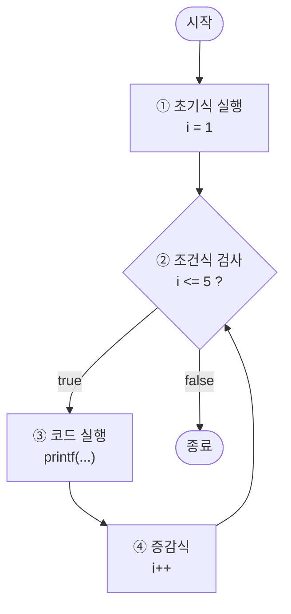
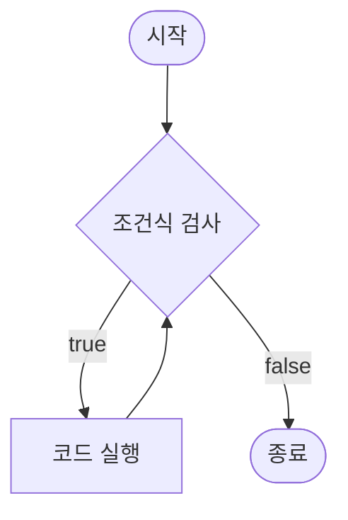
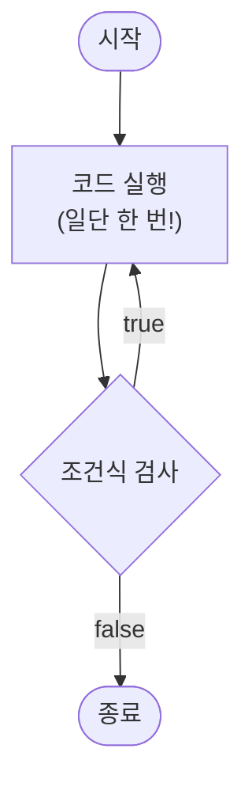

# Day 04: 반복문 — "빙글빙글 돌려보자!" 🔄

## 📚 학습 목표
- `for`문으로 정해진 횟수만큼 반복하기
- `while`과 `do-while`로 조건 기반 반복하기
- 중첩 반복문과 `break`, `continue` 활용하기
- 반복문을 활용한 재미있는 프로그램 만들기

## ⏰ 시간 배분 (3시간)
| 시간 | 내용 | 이론 | 실습 |
|------|------|------|------|
| 50분 | **1교시**: for문 — 정해진 횟수만큼 반복! | 20분 | 30분 |
| 10분 | 휴식 | - | - |
| 50분 | **2교시**: while / do-while — 조건이 맞을 때까지! | 20분 | 30분 |
| 10분 | 휴식 | - | - |
| 50분 | **3교시**: 중첩 반복문 & 종합 실습 | 15분 | 35분 |
| 10분 | Q&A 및 정리 | - | - |

> **강사 노트**: 반복문은 처음엔 어려워 보이지만, "같은 일을 여러 번 하는 것"이라고 단순하게 설명하세요. 학생들이 직접 숫자가 변하는 것을 눈으로 보면서 이해할 수 있도록 합니다.

---

## 🎯 1교시: for문 — "정해진 횟수만큼 반복!" (50분)

### 📖 이론 (20분)

#### 1.1 왜 반복문이 필요할까?

"Hello"를 5번 출력하고 싶다면?

**반복문 없이:**
```c
printf("Hello\n");
printf("Hello\n");
printf("Hello\n");
printf("Hello\n");
printf("Hello\n");
```
😱 만약 100번이면? 1000번이면? → **반복문을 쓰자!**

**반복문으로:**
```c
for (int i = 0; i < 5; i++) {
    printf("Hello\n");
}
```
✅ 단 3줄로 해결!

#### 1.2 for문 기본 구조

```c
for (초기식; 조건식; 증감식) {
    // 반복할 코드
}
```

**비유**: 운동장 달리기 🏃
- **초기식**: "1바퀴부터 시작!" → `int i = 1`
- **조건식**: "5바퀴까지 뛰어!" → `i <= 5`
- **증감식**: "한 바퀴 끝!" → `i++`

```c
//       시작    조건      한 바퀴 끝
for (int i = 1; i <= 5; i++) {
    printf("%d바퀴째 달리는 중...\n", i);
}
printf("운동 끝! 수고했어요!\n");
```

#### 1.3 for문 실행 순서

```
┌─────────────────────────────────────┐
│  ① 초기식 실행 (딱 한 번만!)        │
│  ② 조건식 검사 → false면 종료       │
│  ③ 코드 블록 실행                   │
│  ④ 증감식 실행                      │
│  ⑤ ②번으로 돌아감                   │
└─────────────────────────────────────┘
```



#### 1.4 다양한 for문 패턴

```c
// 패턴 1: 0부터 시작 (가장 많이 쓰는 패턴!)
for (int i = 0; i < 5; i++) { }    // 0,1,2,3,4 → 5번 반복

// 패턴 2: 1부터 시작
for (int i = 1; i <= 5; i++) { }   // 1,2,3,4,5 → 5번 반복

// 패턴 3: 거꾸로 (카운트다운)
for (int i = 5; i >= 1; i--) { }   // 5,4,3,2,1

// 패턴 4: 2씩 증가 (짝수만)
for (int i = 0; i <= 10; i += 2) { }  // 0,2,4,6,8,10
```

---

### 💻 실습 (30분)

#### 💻 실습 4-1: 1부터 10까지 출력 (5분)

**목표**: 가장 기본적인 for문 사용하기

```c
#include <stdio.h>

int main() {
    printf("=== 1부터 10까지 ===\n");
    
    for (int i = 1; i <= 10; i++) {
        printf("%d ", i);
    }
    printf("\n");
    
    return 0;
}
```

**실행 결과:**
```
=== 1부터 10까지 ===
1 2 3 4 5 6 7 8 9 10
```

**도전**: 10부터 1까지 거꾸로 출력해보세요! (카운트다운 🚀)

---

#### 💻 실습 4-2: 구구단 한 단 출력 (10분)

**목표**: for문으로 구구단 출력하기

```c
#include <stdio.h>

int main() {
    int dan;
    
    printf("몇 단을 출력할까요? ");
    scanf("%d", &dan);
    
    printf("\n=== %d단 ===\n", dan);
    for (int i = 1; i <= 9; i++) {
        printf("%d × %d = %d\n", dan, i, dan * i);
    }
    
    return 0;
}
```

**실행 결과:**
```
몇 단을 출력할까요? 7

=== 7단 ===
7 × 1 = 7
7 × 2 = 14
...
7 × 9 = 63
```

---

#### 💻 실습 4-3: 1부터 N까지 합계 계산기 (15분)

**목표**: 반복문으로 누적 합계 구하기

```c
#include <stdio.h>

int main() {
    int n;
    int sum = 0;  // 합계를 저장할 변수 (0으로 초기화!)
    
    printf("어디까지 더할까요? ");
    scanf("%d", &n);
    
    for (int i = 1; i <= n; i++) {
        sum += i;  // sum = sum + i
    }
    
    printf("1부터 %d까지의 합: %d\n", n, sum);
    
    // 검증: 수학 공식 n*(n+1)/2
    printf("공식 검증: %d\n", n * (n + 1) / 2);
    
    return 0;
}
```

**실행 결과:**
```
어디까지 더할까요? 100
1부터 100까지의 합: 5050
공식 검증: 5050
```

**핵심 포인트:**
- `sum = 0`으로 초기화 필수! (안 하면 쓰레기 값)
- `sum += i`는 `sum = sum + i`와 같음

---

## 🎯 2교시: while / do-while — "조건이 맞을 때까지!" (50분)

### 📖 이론 (20분)

#### 2.1 while문 — "조건이 참인 동안 계속!"

**기본 형식:**
```c
while (조건식) {
    // 조건이 참(true)인 동안 반복
}
```

**비유**: 배고픈 동안 밥 먹기 🍚
```
while (배고프다) {
    밥을 한 숟갈 먹는다;
}
// 배부르면 종료!
```



**for문 vs while문:**

| 구분 | for문 | while문 |
|------|-------|---------|
| 언제? | 반복 횟수를 **알 때** | 반복 횟수를 **모를 때** |
| 예시 | "5번 반복해" | "맞출 때까지 반복해" |
| 구조 | 초기식·조건·증감 한 줄에 | 조건만, 나머지는 따로 |

#### 2.2 do-while문 — "일단 한 번은 해보자!"

**기본 형식:**
```c
do {
    // 일단 한 번 실행!
} while (조건식);  // ← 세미콜론 주의!
```

**비유**: 식당 음식 맛보기 🍽️
```
do {
    음식을 맛본다;  // 일단 한 번은 먹어봐야지!
} while (맛있다);  // 맛있으면 더 먹고, 아니면 그만
```



**while vs do-while 핵심 차이:**

```c
// while: 조건이 거짓이면 한 번도 실행 안 함
int x = 10;
while (x < 5) {
    printf("실행됨!\n");  // ❌ 실행 안 됨!
}

// do-while: 조건이 거짓이어도 한 번은 실행
int y = 10;
do {
    printf("실행됨!\n");  // ✅ 한 번은 실행됨!
} while (y < 5);
```

#### 2.3 무한루프와 탈출

```c
// 무한루프 (주의! 탈출 조건 필수!)
while (1) {
    // 영원히 반복...
    if (탈출조건) break;  // break로 탈출!
}
```

---

### 💻 실습 (30분)

#### 💻 실습 4-4: 숫자 맞추기 게임 🎯 (15분)

**목표**: while문으로 "맞출 때까지" 반복하기

```c
#include <stdio.h>
#include <stdlib.h>
#include <time.h>

int main() {
    srand(time(0));
    int answer = rand() % 50 + 1;  // 1~50 랜덤
    int guess;
    int count = 0;
    
    printf("=== 숫자 맞추기 게임 ===\n");
    printf("1~50 사이의 숫자를 맞춰보세요!\n\n");
    
    while (1) {
        printf("입력: ");
        scanf("%d", &guess);
        count++;
        
        if (guess > answer) {
            printf("⬇️ 더 작은 수!\n");
        } else if (guess < answer) {
            printf("⬆️ 더 큰 수!\n");
        } else {
            printf("\n🎉 정답! %d번 만에 맞췄습니다!\n", count);
            break;
        }
    }
    
    return 0;
}
```

**실행 예시:**
```
=== 숫자 맞추기 게임 ===
1~50 사이의 숫자를 맞춰보세요!

입력: 25
⬇️ 더 작은 수!
입력: 12
⬆️ 더 큰 수!
입력: 18
🎉 정답! 3번 만에 맞췄습니다!
```

---

#### 💻 실습 4-5: 메뉴 반복 프로그램 🍔 (15분)

**목표**: do-while로 "다시 할래?" 패턴 구현하기

```c
#include <stdio.h>

int main() {
    int choice;
    
    do {
        printf("\n===== 🍔 햄버거 가게 =====\n");
        printf("1. 치즈버거  (3000원)\n");
        printf("2. 불고기버거 (4000원)\n");
        printf("3. 새우버거  (3500원)\n");
        printf("0. 나가기\n");
        printf("주문: ");
        scanf("%d", &choice);
        
        switch (choice) {
            case 1: printf("🧀 치즈버거 주문 완료!\n"); break;
            case 2: printf("🥩 불고기버거 주문 완료!\n"); break;
            case 3: printf("🦐 새우버거 주문 완료!\n"); break;
            case 0: printf("👋 안녕히 가세요!\n"); break;
            default: printf("❌ 잘못된 번호!\n"); break;
        }
    } while (choice != 0);
    
    return 0;
}
```

**핵심 포인트:**
- `do-while`은 **메뉴를 최소 한 번은 보여줘야 하는 상황**에 딱!
- `choice != 0`이 거짓(0을 입력)이 되면 종료

---

## 🎯 3교시: 중첩 반복문 & 종합 실습 (50분)

### 📖 이론 (15분)

#### 3.1 중첩 for문 — "시계의 시침과 분침" ⏰

시계를 생각해보세요:
- **시침**이 1시간 갈 동안 **분침**은 60번 돈다!
- 바깥 반복 1번 = 안쪽 반복 전체 1세트

```c
// 바깥 루프: 시침 (느리게)
for (int hour = 1; hour <= 3; hour++) {
    // 안쪽 루프: 분침 (빠르게)
    for (int min = 0; min < 60; min++) {
        printf("%d시 %d분\n", hour, min);
    }
}
```

**실행 패턴:**
```
1시 0분, 1시 1분, ... 1시 59분,
2시 0분, 2시 1분, ... 2시 59분,
3시 0분, 3시 1분, ... 3시 59분
```

#### 3.2 break와 continue

| 키워드 | 기능 | 비유 |
|--------|------|------|
| `break` | 반복문 **즉시 탈출** | 비상구로 나가기 🚪 |
| `continue` | 이번 회차 **건너뛰기** | 이번 건 패스! ⏭️ |

```c
// break: 5에서 멈춤
for (int i = 1; i <= 10; i++) {
    if (i == 5) break;     // 5에서 탈출!
    printf("%d ", i);       // 출력: 1 2 3 4
}

// continue: 3만 건너뜀
for (int i = 1; i <= 5; i++) {
    if (i == 3) continue;  // 3은 패스!
    printf("%d ", i);       // 출력: 1 2 4 5
}
```

---

### 💻 실습 (35분)

#### 💻 실습 4-6: 별 찍기 삼각형 ★ (10분)

**목표**: 중첩 for문으로 패턴 출력하기

```c
#include <stdio.h>

int main() {
    int n;
    
    printf("몇 줄? ");
    scanf("%d", &n);
    
    printf("\n=== 별 삼각형 ===\n");
    for (int i = 1; i <= n; i++) {
        for (int j = 1; j <= i; j++) {
            printf("★ ");
        }
        printf("\n");
    }
    
    return 0;
}
```

**실행 결과 (n=5):**
```
=== 별 삼각형 ===
★ 
★ ★ 
★ ★ ★ 
★ ★ ★ ★ 
★ ★ ★ ★ ★ 
```

**도전**: 역삼각형(위가 넓고 아래가 좁은)도 만들어보세요!

---

#### 💻 실습 4-7: 구구단 전체 출력 (10분)

**목표**: 중첩 for문으로 2~9단 전체 출력

```c
#include <stdio.h>

int main() {
    printf("===== 구구단 전체 =====\n\n");
    
    for (int dan = 2; dan <= 9; dan++) {
        printf("[ %d단 ]\n", dan);
        for (int i = 1; i <= 9; i++) {
            printf("%d × %d = %2d\n", dan, i, dan * i);
        }
        printf("\n");
    }
    
    return 0;
}
```

**핵심**: 바깥 for = 단(2~9), 안쪽 for = 곱하는 수(1~9)

---

#### 💻 종합 실습 4-8: 🎮 가위바위보 3판 2선승제 (15분)

**목표**: 반복문 + 조건문 + 랜덤을 모두 활용한 종합 실습

```c
#include <stdio.h>
#include <stdlib.h>
#include <time.h>

int main() {
    srand(time(0));
    
    int player_win = 0, com_win = 0;
    int round = 0;
    
    printf("===== 🎮 가위바위보 3판 2선승 =====\n");
    printf("(0:가위  1:바위  2:보)\n");
    
    while (player_win < 2 && com_win < 2) {
        round++;
        int player, com;
        
        printf("\n--- %d라운드 ---\n", round);
        printf("입력: ");
        scanf("%d", &player);
        
        com = rand() % 3;
        
        // 이름 출력
        char *names[] = {"가위✌️", "바위✊", "보🖐️"};
        printf("나: %s  vs  컴퓨터: %s\n", names[player], names[com]);
        
        // 승부 판정
        if (player == com) {
            printf("😐 비겼습니다!\n");
        } else if ((player == 0 && com == 2) ||
                   (player == 1 && com == 0) ||
                   (player == 2 && com == 1)) {
            printf("🎉 이겼습니다!\n");
            player_win++;
        } else {
            printf("😢 졌습니다!\n");
            com_win++;
        }
        
        printf("현재 점수 — 나 %d : %d 컴퓨터\n", player_win, com_win);
    }
    
    printf("\n===== 최종 결과 =====\n");
    if (player_win == 2)
        printf("🏆 축하합니다! 승리!\n");
    else
        printf("💀 아쉽네요... 패배!\n");
    
    return 0;
}
```

**실행 예시:**
```
===== 🎮 가위바위보 3판 2선승 =====
(0:가위  1:바위  2:보)

--- 1라운드 ---
입력: 1
나: 바위✊  vs  컴퓨터: 가위✌️
🎉 이겼습니다!
현재 점수 — 나 1 : 0 컴퓨터

--- 2라운드 ---
입력: 0
나: 가위✌️  vs  컴퓨터: 보🖐️
🎉 이겼습니다!
현재 점수 — 나 2 : 0 컴퓨터

===== 최종 결과 =====
🏆 축하합니다! 승리!
```

---

## 📝 핵심 정리

### 오늘 배운 내용 한눈에 보기

| 반복문 | 언제 쓸까? | 형태 |
|--------|-----------|------|
| **for** | 횟수를 **알 때** | `for (i=0; i<n; i++)` |
| **while** | 횟수를 **모를 때** | `while (조건)` |
| **do-while** | **최소 1번**은 실행 | `do { } while (조건);` |

| 제어문 | 기능 |
|--------|------|
| **break** | 반복문 즉시 탈출 🚪 |
| **continue** | 이번 회차만 건너뛰기 ⏭️ |

### 자주 하는 실수 ⚠️

```c
// 실수 1: 무한루프 (증감식 빼먹음)
int i = 0;
while (i < 5) {
    printf("%d\n", i);
    // i++; 을 빠뜨리면 무한루프!
}

// 실수 2: off-by-one 에러
for (int i = 1; i <= 10; i++)  // 10번 반복 ✅
for (int i = 0; i < 10; i++)   // 10번 반복 ✅
for (int i = 1; i < 10; i++)   // 9번 반복 ⚠️

// 실수 3: do-while 세미콜론
do {
    // ...
} while (조건);  // ← 세미콜론 필수!
```

---

## 📝 과제

### 과제 1: 짝수의 합 계산기
1부터 N까지 **짝수만** 더하는 프로그램을 작성하세요.
- 힌트: `if (i % 2 == 0)` 또는 `for (i = 2; i <= n; i += 2)`

### 과제 2: 별 찍기 — 다이아몬드 💎
아래처럼 출력하는 프로그램을 작성하세요 (N=5):
```
    ★
   ★★★
  ★★★★★
 ★★★★★★★
★★★★★★★★★
 ★★★★★★★
  ★★★★★
   ★★★
    ★
```

### 과제 3: 소수 찾기
2부터 N까지의 **소수(Prime Number)**를 모두 출력하세요.
- 소수 = 1과 자기 자신으로만 나누어지는 수
- 힌트: 중첩 for문 + break 활용
